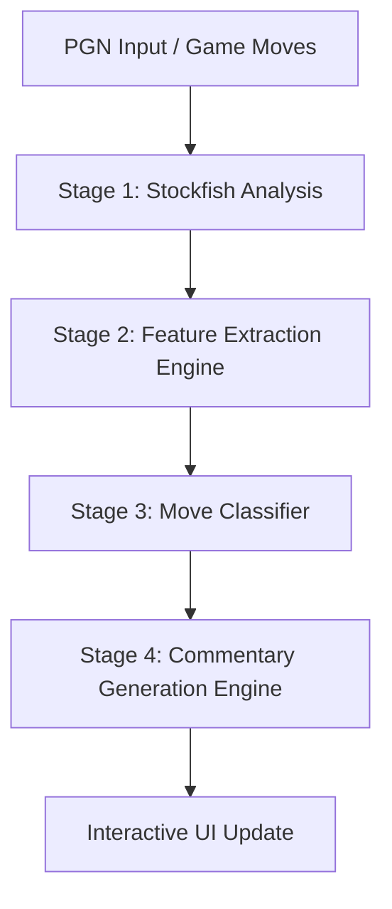

# DeepMate Game Review Engine: 4-Stage Architectural Implementation

This document provides a detailed breakdown of the 4-stage game review engine used in DeepMate, explaining the calculations, algorithms, and chess heuristics powering the analysis pipeline.

---

## 🗺️ Architectural Overview

DeepMate decouples game review into four sequential, independent processing stages. This ensures modular testing, eliminates complex state dependencies, and keeps all processing fast, client-side, and deterministic.



---

## 📈 Stage 1: Stockfish Analysis & Score Normalization

The analysis worker processes FEN states for every position in the game using Stockfish. Because raw engine evaluations are returned relative to the *active player's side*, they must be normalized before classification.

### 1. Perspective Normalization
All centipawn evaluations (`evalScore`) are normalized to White's perspective:
$$Score_{White} = \begin{cases} Score_{Raw} & \text{if White to move} \\ -Score_{Raw} & \text{if Black to move} \end{cases}$$
*   **Positive (+) scores** always indicate an advantage for White.
*   **Negative (-) scores** always indicate an advantage for Black.

### 2. Mate Score Normalization
Mates are assigned extreme values to prevent calculation overflows during math subtraction operations:
*   `+99.0` represents forced mate in favor of White ($+M$).
*   `-99.0` represents forced mate in favor of Black ($-M$).

### 3. PV & Move Rank
Using multi-PV settings, we rank the played move against Stockfish's top choices:
*   Rank `1` if the played move coordinates match the top recommended `bestmove` string.
*   Rank `2+` mapped by checking the played move's position within the multi-PV lines.

---

## 🔎 Stage 2: Feature Extraction Engine

The Feature Extraction Engine (`js/features.js`) calculates objective facts about each move by comparing the chess state immediately **before** the move (`chessBefore`) with the state **after** the move (`chessAfter`).

Below are the detailed heuristics for the 12 feature categories:

### 1. Engine Analysis Features
*   **Centipawn Loss (`centipawnLoss`):** Calculated based on the drop in perspective-normalized score from the player's perspective:
    *   For White: $\max(0, Score_{Before} - Score_{After})$
    *   For Black: $\max(0, Score_{After} - Score_{Before})$
*   **Only Move (`onlyMove`):** Checked by checking if the player had exactly one legal move in `chessBefore`.
*   **Book Move (`bookMove`):** A simple index threshold. Any move played within the first 8 half-moves (`moveIdx < 8`) is flagged.
*   **Game Phase (`gamePhase`):**
    *   `opening`: Standard opening index threshold or high piece count.
    *   `endgame`: Triggered when both sides have no queens, or when either side has only a queen and no other major/minor pieces, or the total material value on the board is less than or equal to 13.
    *   `middlegame`: Default fallback.

### 2. Move Information Features
*   **Move type flags:** Checked directly from Chess.js move verbose details:
    *   `capture`: Set to true if `move.captured` is present or flag contains `'c'` or `'e'`.
    *   `check` / `checkmate`: Checked using `chessAfter.in_check()` / `in_checkmate()`.
    *   `promotion`: Flag contains `'p'`.
    *   `kingsideCastle` / `queensideCastle`: Set when `move.san` equals `O-O` / `O-O-O`.

### 3. Material Heuristics
*   **Piece Value mapping:** P = 1, N = 3, B = 3, R = 5, Q = 9.
*   **Trade Analysis:** A trade is detected when a piece captures an opponent's piece on `sq` and the opponent immediately recaptures on the same square.
    *   **Equal Trade:** Value of captured piece equals the value of the capturing piece.
    *   **Favorable Trade:** Value of captured piece exceeds the capturing piece.
    *   **Unfavorable Trade:** Value of captured piece is less than the capturing piece.
*   **Tactical Sacrifice (`sacrifice`):** Triggered when a player moves a piece to a square where it can be captured by an opponent piece of lower value, or leaves a piece undefended on a square attacked by the opponent, resulting in a loss of material in the short term.
    *   **Temporary Sacrifice:** The sacrifice is played, but the centipawn evaluation remains stable or improves ($\le 0.5$ CP loss), showing the sacrifice is sound and leads to positional compensation.
    *   **Permanent Sacrifice:** Material is lost, and the evaluation drops significantly ($> 0.5$ CP loss).

### 4. Tactical Motifs
*   **Fork (`detectFork`):** Checked by checking if the active piece on its destination square attacks at least two opponent pieces of value $\ge 3$ (Knight, Bishop, Rook, Queen), the King, or an undefended pawn.
*   **Pin (`detectPin`):** Runs a ray search from a sliding piece (Bishop, Rook, Queen) along its attack paths. A pin is detected if:
    1.  The ray hits exactly one opponent piece (pinned piece).
    2.  Continuing along that ray, it hits a second opponent piece of higher value (King, Queen, Rook, or a minor piece of higher value than the pinned piece).
    3.  If the second piece is the King, it is flagged as an absolute pin.
*   **Skewer (`detectSkewer`):** The inverse of a pin. A ray search from a slider hits a high-value opponent piece first (e.g. King, Queen) and then a lower-value opponent piece behind it. Moving the high-value piece out of attack allows capture of the piece behind it.
*   **Battery (`detectBattery`):** Checked by examining if two friendly sliders of matching attack profiles (Rook + Queen, Bishop + Queen, or Rook + Rook) occupy the same rank, file, or diagonal with no intervening pieces.
*   **Discovered Attack (`detectDiscoveredAttack`):** Simulates the position by removing the played piece from its origin square on a copy of the board (`tempChess`). If any sliding piece behind it now attacks a square or piece that it could not attack before, a discovered attack is registered.

### 5. King Safety
*   **Luft (`createdLuft`):** A pawn move in front of a castled king (e.g. `h3`, `g3`, `f3` for White after castling kingside) that creates an escape square for the king, preventing back-rank mates.
*   **King File/Diagonal Exposure:** Checks if pawns are cleared on the king's file (`openedKingFile`) or adjacent diagonals (`openedKingDiagonal`).
*   **Attackers/Defenders Count:** Tallies the number of opponent pieces attacking squares in the king's immediate neighborhood (a $3 \times 3$ grid surrounding the king) versus friendly defenders.

### 6. Pawn Structure
*   **Passed Pawn (`createdPassedPawn`):** A pawn that has no opposing pawns in front of it on its own file or on adjacent files.
*   **Isolated Pawn:** A pawn that has no friendly pawns on adjacent files.
*   **Doubled Pawns:** Having two pawns of the same color on the same file.
*   **Backward Pawn:** A pawn that is behind friendly pawns on adjacent files and cannot be safely advanced because its destination square is defended by an enemy pawn.

### 7. Piece Activity
*   **Rook on Seventh Rank:** A rook located on the 7th rank (for White) or 2nd rank (for Black), placing pressure on the opponent's pawns and king.
*   **OpenFile / HalfOpenFile:** A file with no pawns is an open file; a file with only opponent pawns is a half-open file.
*   **Knight Outpost (`knightOutpost`):** A knight placed on a square on the 4th, 5th, or 6th rank that is defended by a friendly pawn and cannot be attacked or driven away by an opponent's pawn.

### 8. Positional Features
*   **Center Control:** Calculated by counting the total number of attacks controlled by the player on the four central squares (`d4`, `d5`, `e4`, `e5`).

### 9. Threat Detection
*   **Threats (`threatensQueen`, `threatensRook`, etc.):** Checked by comparing attacks from the moved piece's landing square. If it attacks an opponent piece that was not under attack by any friendly piece prior to the move, a threat is registered.

### 10. Move Difficulty
*   **Forcing Move:** Any move that is a check, capture, or mate threat.
*   **Quiet Move:** A move that does not make a check, capture, or directly attack a high-value piece.
*   **Critical Move:** Triggers when the position has a forced mate sequence, or when the player has a winning advantage ($\ge 1.5$) and plays a move losing more than 1.0 centipawn, showing a high-stakes decision point.

### 11. Endgame Features
*   **King Activity:** Measured in the endgame by the king's Manhattan distance from its starting back-rank square towards the center.
*   **Zugzwang:** Triggered if the opponent has $\le 5$ legal moves and their best legal option drops their evaluation by $\ge 0.5$ centipawns.

### 12. Draw & Rule Features
*   Stalemate, threefold repetition, fifty-move counter, and insufficient material draws are checked using Chess.js state checkers.

---

## 🎛️ Stage 3: Move Classifier

The Move Classifier (`js/classifier.js`) maps the extracted features to one of the **13 move quality classifications** using a priority-ordered ruleset:

```
                  ┌─────────────────────────────┐
                  │          START              │
                  └──────────────┬──────────────┘
                                 ▼
                          Is Book Move? ───────► YES ──► [ Book ]
                                 │ NO
                                 ▼
                         Is Forced Move? ──────► YES ──► [ Forced ]
                                 │ NO
                                 ▼
                          Was Winning & ───────► YES ──► [ Missed Win ]
                        Dropped Advantage?
                                 │ NO
                                 ▼
                           Was Equal & ────────► YES ──► [ Missed Draw ]
                         Became Lost?
                                 │ NO
                                 ▼
                         Is Best Move & ───────► YES ──► [ Brilliant ]
                         Sound Sacrifice?
                                 │ NO
                                 ▼
                         Is Best Move & ───────► YES ──► [ Great Move ]
                       Tactical/Critical motif?
                                 │ NO
                                 ▼
                          Missed Threat/ ──────► YES ──► [ Miss ]
                         Hanging piece?
                                 │ NO
                                 ▼
                        Centipawn Loss ────────► [ Best / Excellent / Good /
                           Thresholds            Inaccuracy / Mistake / Blunder ]
```

### Classification Rules Table

| Priority | Classification | Technical Rule / Condition |
| :--- | :--- | :--- |
| **1** | **Book** | `bookMove === true` (played within opening threshold). |
| **2** | **Forced** | `forcedMove === true` (only one legal move was available). |
| **3** | **Missed Win** | Player was winning ($\ge 2.5$ for White, $\le -2.5$ for Black), played a non-best move (`rank > 1`), and evaluation dropped significantly (eval after move $< 1.0$ for White, $> -1.0$ for Black). |
| **4** | **Missed Draw** | Position was equal, played a non-best move, and dropped into a lost position (eval after move $< -1.8$ for White, $> 1.8$ for Black). |
| **5** | **Brilliant** | Move played is the top engine move (`engineRank === 1`), and it is a successful temporary sacrifice (`sacrifice === true && temporarySacrifice === true`). |
| **6** | **Great Move** | Move played is the top engine move, and it either created a tactical motif (`createdFork`, `createdPin`, `createdSkewer`, `createdBattery`, `createdDiscoveredAttack`), was `criticalMove === true`, or was an `onlyMove === true`. |
| **7** | **Miss** | Non-best move (`centipawnLoss >= 0.8`) that failed to capture an opponent's hanging piece or failed to counter/exploit a mate threat. |
| **8** | **Best** | Top engine choice (`engineRank === 1`) or centipawn loss is negligible (`centipawnLoss <= 0.05`). |
| **9** | **Excellent** | Centipawn loss is low (`centipawnLoss <= 0.15`). |
| **10** | **Good** | Centipawn loss is moderate (`centipawnLoss <= 0.40`). |
| **11** | **Inaccuracy** | Centipawn loss is slightly high (`centipawnLoss <= 0.90`). |
| **12** | **Mistake** | Centipawn loss is high (`centipawnLoss <= 2.00`). |
| **13** | **Blunder** | Centipawn loss is severe (`centipawnLoss > 2.00`). |

---

## 🎙️ Stage 4: Commentary Generation Engine

The Commentary Generation Engine (`js/classifier.js`) synthesizes descriptive feedback using a **fragment-based template system**. 

### 1. Narrative Assembly Pipeline
Commentary is constructed dynamically by concatenating three distinct phrase fragments:

$$\text{Commentary} = \text{Introductory Speech} + \text{Tactical Fact} + \text{Engine Alternative}$$

```
   [ Intro Fragment ]        +      [ Fact Fragment ]      +    [ Alternative Suggestion ]
(Classification evaluation)      (Tactical/Positional details)      (suboptimal move advice)
```

### 2. Template Variations
To prevent repetitive responses, each fragment uses multiple phrasing templates that are selected randomly:

*   **Introductory Variations:**
    *   *Blunder example:* 
        *   "Oh no! That is a blunder. You completely gave away the position."
        *   "A critical blunder! You left yourself in a losing position."
        *   "Oh no, a major blunder! This completely throws away the game."
*   **Tactical Fact Variations:**
    *   *Pin example:*
        *   "This pins an opponent's piece, restricting its movement."
        *   "Creating a pin to restrict their piece's mobility."
        *   "This pins a defender, making it difficult for your opponent to coordinate."
*   **Alternative Suggestion Variations:**
    *   *Suggestion example:*
        *   "Better was [bestMove]."
        *   "Instead, you should have played [bestMove]."
        *   "You had a better line with [bestMove]."
        *   "Finding [bestMove] would have been a superior option."
